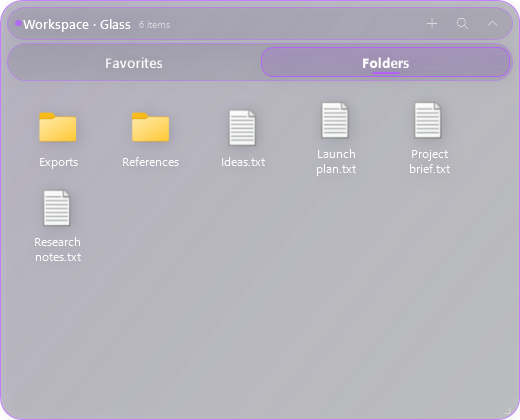
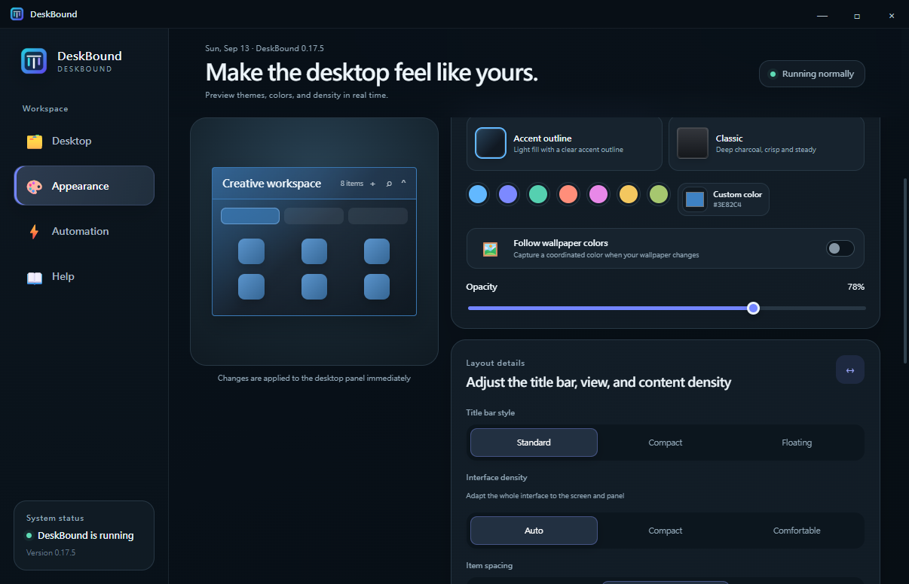
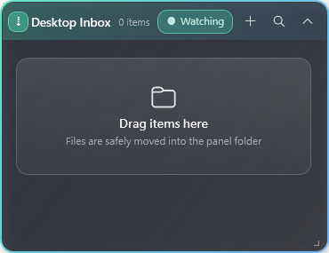
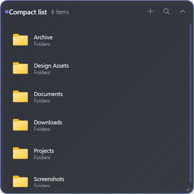

  

<h1 align="center">DeskBound</h1>

A calm, practical home for everything on your Windows desktop.

  <a href="README.zh-TW.md"><strong>繁體中文</strong></a> ·
  <a href="https://github.com/bestdrduck/DeskBound/releases/latest"><strong>Download DeskBound</strong></a>

  
  

DeskBound is a lightweight Windows desktop organizer. Keep files, folders, and shortcuts in movable panels, switch between tabs, and keep your real desktop under control without hiding the files themselves.

## Highlights

- Movable, resizable, collapsible panels with multiple tabs
- Icon grid and compact list views, with per-tab sorting and layout controls
- Drag items in and out, multi-selection, search, thumbnails, and Explorer-style shortcuts
- Optional Desktop Inbox for newly arriving desktop items
- Custom accent colors, opacity, panel materials, icon sizing, spacing, and density
- Layout snapshots, scenes, smart organization, and undo
- Automatic recovery for interrupted monitoring and desktop-shell input
- Built-in integrity-checked updates through the installed helper
- English and Traditional Chinese interface, with a system-language option
- Anonymous diagnostics and a path-free support ZIP for troubleshooting
- And more!

  

  
  &nbsp;&nbsp;
  

  
  &nbsp;&nbsp;
  

## Install and update

Download `DeskBound-Setup.exe` from the [latest release](https://github.com/bestdrduck/DeskBound/releases/latest). The installer lets you choose the install location and creates a desktop shortcut named `DeskBound` or `桌伴` according to the Windows display language.

DeskBound checks for updates at startup and periodically while it is running. In-app updates download an integrity-checked data package and apply it through the installed helper; your panels, settings, and desktop files stay in place. Setup is also available for a fresh install or recovery.

DeskBound is not code-signed yet, so Windows SmartScreen may show a first-run warning.

## Requirements

- Windows 10 or Windows 11, 64-bit
- A normal per-user installation account
- Microsoft Edge WebView2 Runtime for the full control center; a native compatibility view remains available when it is not present

## Privacy and data safety

DeskBound works with the files on your computer and stores its settings locally. It does not require a DeskBound account. Diagnostics are opt-in and designed to exclude file names, paths, panel names, layout contents, and secrets.

The application is distributed as compiled releases. The source repository is maintained privately; this distribution repository contains only user-facing documentation, images, and release downloads.
