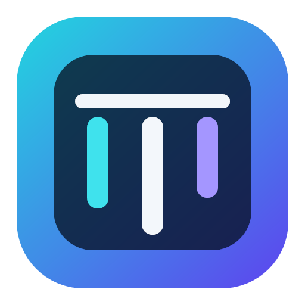

<p align="center">
  
</p>

<h1 align="center">DeskBound</h1>

<p align="center">Keep your desktop organized without changing the way you work.</p>

<p align="center">
  <strong>English</strong> · <a href="README.zh-TW.md">繁體中文</a> ·
  <a href="https://github.com/bestdrduck/DeskBound/releases/latest">Download</a>
</p>

DeskBound is a lightweight desktop organizer for Windows 10 and Windows 11. It groups files, folders, and shortcuts into movable, tabbed desktop panels while keeping every item as a real Windows file.

## Download

Download `DeskBound.exe` from [GitHub Releases](https://github.com/bestdrduck/DeskBound/releases/latest). First launch starts with an empty layout and never moves existing desktop items automatically.

## Highlights

- Movable, resizable, collapsible panels with multiple tabs
- Drag items in and out, or collect new desktop items with Desktop Inbox
- Folder navigation, search, sorting, thumbnails, and multi-selection
- Smart organization, layout snapshots, scenes, and persistent undo
- Custom visual styles and Wallpaper Engine support
- Safe, SHA-256-verified updates starting with version 0.13.0
- And more…

## Data safety

Removing a panel or tab does not delete its files. Name collisions never overwrite existing items, layout data keeps a backup, and a failed application update restores the previous executable.

## Build

```powershell
.\build.ps1
```

The local build is written to `outputs\桌伴.exe`.
