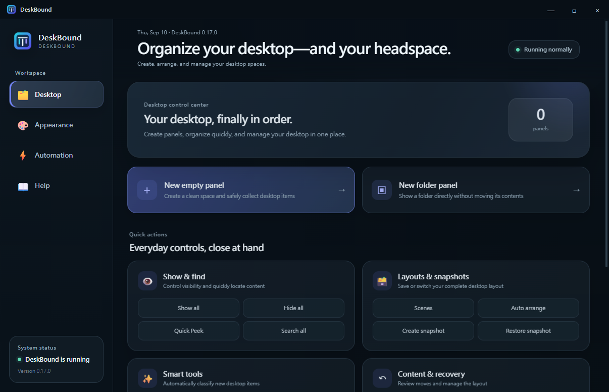
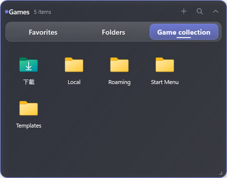
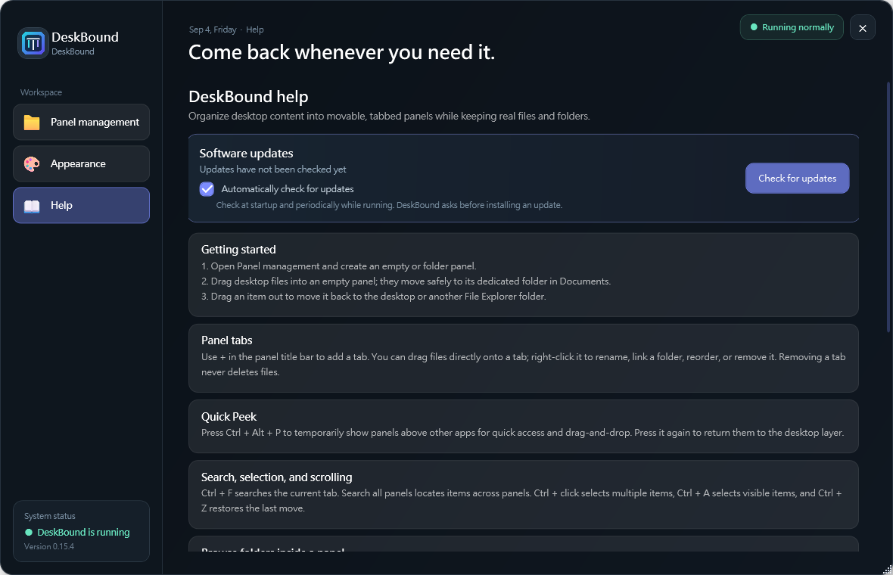

<p align="center">
  
</p>

<h1 align="center">DeskBound</h1>

<p align="center">A calm, practical home for everything on your Windows desktop.</p>

<p align="center">
  <a href="https://github.com/bestdrduck/DeskBound/releases/latest"></a>
  
  
</p>

<p align="center">
  <strong>English</strong> · <a href="README.zh-TW.md">繁體中文</a> ·
  <a href="https://github.com/bestdrduck/DeskBound/releases/latest"><strong>Download Setup</strong></a>
</p>

<p align="center">
  
</p>

DeskBound is a lightweight desktop organizer for Windows 10 and Windows 11. It groups files, folders, and shortcuts into movable, tabbed desktop panels while keeping every item as a real Windows file.

## Designed for a real desktop

| Organize naturally | Stay in control | Make it yours |
| --- | --- | --- |
| Drag items into panels, use tabs, or let Desktop Inbox collect new arrivals. | Move items back out at any time. Removing a panel never deletes its files. | Adjust panel style, opacity, scale, layout, and behavior around your wallpaper. |

## Highlights

- Movable, resizable, collapsible panels with multiple tabs
- Drag items in and out, plus an optional Desktop Inbox
- Search, sorting, thumbnails, multi-selection, smart organization, and undo
- Layout snapshots, scenes, custom visual styles, and Wallpaper Engine support
- English and Traditional Chinese interface with a system-language option
- Built-in installer-based updates with integrity checks
- And more!

<p align="center">
  
  &nbsp;&nbsp;
  
</p>

## Install and update

Download `DeskBound-Setup.exe` from [GitHub Releases](https://github.com/bestdrduck/DeskBound/releases/latest). The installer lets you choose where DeskBound is installed, creates a desktop shortcut, and remembers that location for future upgrades. First launch starts with an empty layout and never moves existing desktop items automatically.

DeskBound is not code-signed yet, so Windows SmartScreen may show a warning on first install.

DeskBound checks for updates at startup and every six hours while it remains open. It downloads the official Setup asset, verifies its SHA-256 digest, asks before installing, and upgrades in the current application directory. Users of the older portable 0.13 release need to run Setup once to switch to this update path.

## Your data stays separate

Settings, layout data, backups, and snapshots live outside the application folder. Updates and reinstalls therefore leave them in place. A versioned settings schema handles future format changes automatically; name collisions never overwrite existing files.

## Build

```powershell
.\build.ps1
```

The local application build is written to `outputs\桌伴.exe`. GitHub Releases publish only the Setup installer.
