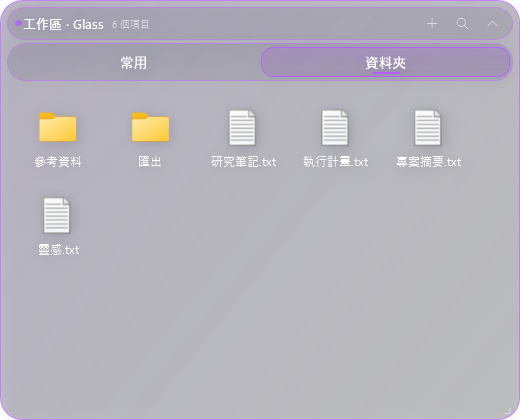
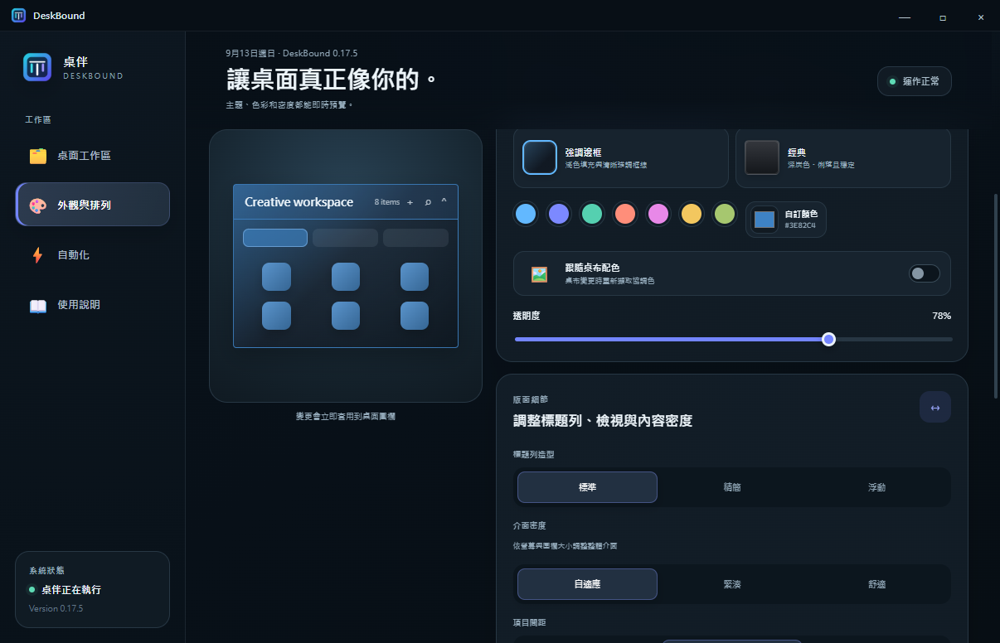
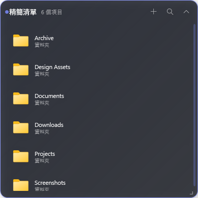

  

<h1 align="center">桌伴 DeskBound</h1>

替 Windows 桌面上的一切，留一個安靜又好用的位置。

  <a href="README.md"><strong>English</strong></a> ·
  <strong>繁體中文</strong> ·
  <a href="https://github.com/bestdrduck/DeskBound/releases/latest"><strong>下載桌伴</strong></a>

桌伴是一款輕量的 Windows 桌面整理工具。把檔案、資料夾與捷徑放進可移動的圍欄，使用分頁整理，同時保留真正的桌面檔案。

## 主要功能

- 可移動、縮放與收合的多分頁桌面圍欄
- 圖示格狀與精簡清單檢視，每個分頁可獨立排序與調整版面
- 拖入拖出、多選、搜尋、縮圖與檔案總管風格快捷鍵
- 可選用桌面收件匣，自動接住新到桌面的項目
- 自訂強調色、透明度、材質、圖示大小、間距與介面密度
- 版面快照、情境配置、智慧整理與復原
- 資料夾監看與桌面層輸入中斷時自動復原
- 透過已安裝輔助程式套用並核對完整性的內建更新
- 繁體中文、英文與跟隨系統語言的介面
- 匿名診斷與不含路徑的支援 ZIP
- 還有更多！

  

  
  &nbsp;&nbsp;
  

  
  &nbsp;&nbsp;
  

## 安裝與更新

請從[最新版本](https://github.com/bestdrduck/DeskBound/releases/latest)下載 `DeskBound-Setup.exe`。安裝程式可以自訂安裝位置，並依 Windows 顯示語言建立名為 `桌伴` 或 `DeskBound` 的桌面捷徑。

桌伴會在啟動時及執行期間定期檢查更新。程式內更新會下載並核對完整性的資料套件，再透過已安裝的輔助程式套用；圍欄、設定與桌面檔案都會留在原處。全新安裝或需要修復時，也可以使用 Setup 安裝檔。

桌伴目前尚未加入程式碼簽章，因此第一次啟動時 Windows SmartScreen 可能會顯示提醒。

## 系統需求

- Windows 10 或 Windows 11，64 位元
- 一般的單一使用者安裝權限
- 完整控制中心需要 Microsoft Edge WebView2 Runtime；若電腦沒有，也會保留原生相容介面

## 隱私與資料安全

桌伴直接使用電腦上的檔案，設定儲存在本機，不需要建立桌伴帳號。診斷功能必須由使用者主動匯出，並設計為排除檔名、路徑、圍欄名稱、版面內容與秘密資訊。

桌伴以編譯後的版本發佈；原始碼倉庫採私人維護。本公開倉庫只放使用者說明、圖片與發佈下載檔。
